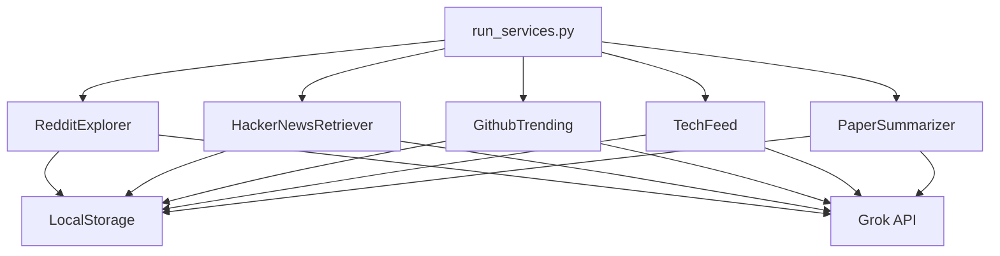

# コンテンツ収集の仕組み

## 概要

Nookのコンテンツ収集システムは、複数のサービスから情報を収集し、要約・翻訳を行った上でローカルストレージに保存します。
各サービスは独立して動作し、共通のストレージシステムを使用します。

## アーキテクチャ



## サービス実行の仕組み

### メインランナー (run_services.py)

- コマンドライン引数で実行するサービスを指定可能
- 全サービスまたは個別サービスの実行をサポート
- 各サービスの実行状態とエラーを監視

```bash
# すべてのサービスを実行
python -m nook.services.run_services --service all

# 個別のサービスを実行
python -m nook.services.run_services --service reddit
```

## 各サービスの動作

### 1. Reddit Explorer

#### 機能
- サブレディットの設定ファイル（subreddits.toml）から対象を読み込み
- 各サブレディットの人気投稿を取得
- 投稿の要約を生成
- Markdownファイルとして保存

#### データ収集フロー
1. Reddit APIで人気投稿を取得
2. 投稿の種類（画像、動画、テキストなど）を判別
3. 投稿内容とコメントを日本語に翻訳
4. Grok APIを使用して投稿を要約
5. カテゴリごとにまとめてMarkdownファイルを生成

### 2. GitHub Trending

#### 機能
- 言語設定ファイル（languages.toml）から対象を読み込み
- GitHub Trendingページをスクレイピング
- リポジトリの説明を日本語に翻訳
- Markdownファイルとして保存

#### データ収集フロー
1. GitHub TrendingページをWebスクレイピング
2. リポジトリ情報（名前、説明、スター数など）を抽出
3. 説明文をGrok APIで日本語に翻訳
4. 言語カテゴリごとにまとめてMarkdownファイルを生成

### 3. Hacker News Retriever
- Hacker News APIから最新のトップ記事を取得
- 記事内容を日本語に翻訳
- 要約を生成してMarkdownファイルとして保存

### 4. Tech Feed
- 設定ファイル（feed.toml）から技術ブログのRSSフィードを読み込み
- 最新の記事を取得して日本語に翻訳
- 要約を生成してMarkdownファイルとして保存

### 5. Paper Summarizer
- arXivから最新の論文を取得
- タイトルと要旨を日本語に翻訳
- 論文の要約を生成してMarkdownファイルとして保存

## 共通コンポーネント 

### LocalStorage
- データの永続化を担当
- 日付ベースのファイル管理
- Markdownファイルとして情報を保存

### Grok3 Client
- テキストの翻訳と要約を担当
- 自然な日本語への翻訳を実行
- コンテキストを考慮した要約を生成

## プロンプトスタイルエディタ

Nookでは、翻訳や要約のスタイルをGUIを通じて編集できるプロンプトスタイルエディタを提供しています。このエディタを使用することで、以下の項目を簡単にカスタマイズできます：

- 翻訳ペルソナ
- 翻訳スタイル
- 要約ペルソナ
- 要約スタイル

### 使用方法

1. プロンプトエディタを起動します：
   ```bash
   python config/prompt_editor.py
   ```

2. 編集したいスタイルを選択します（例：normal, kawaii, cyber）

3. 各項目を編集し、「保存」ボタンをクリックします

4. 変更は即座に反映され、次回のReddit Explorerの実行時に使用されます

### デフォルトのスタイル

- **normal**: 標準的な翻訳と要約スタイル
- **kawaii**: かわいい翻訳と要約スタイル
- **cyber**: サイバーパンク風の翻訳と要約スタイル

新しいスタイルを追加するには、プロンプトエディタで新しいスタイル名を入力し、各項目を編集してください。

## プロンプトスタイルエディタの仕組み

Nookのプロンプトスタイルエディタは、以下の3つの主要なコンポーネントで構成されています：

### 1. prompt_styles.json
- プロンプトスタイルの設定を保存するJSONファイル
- 各スタイルの名前、説明、テンプレートを保持
- GUIエディタで変更した内容がここに保存される

### 2. prompt_editor.py
- プロンプトスタイルを編集するためのGUIアプリケーション
- ユーザーがスタイルを編集する際に使用
- 以下の機能を提供：
  - 既存スタイルの選択と編集
  - 新しいスタイルの追加
  - 変更内容の保存

### 3. prompt_styles.py
- プロンプトスタイルのクラス定義とJSONファイルの読み書き処理
- 以下の機能を提供：
  - JSONファイルからスタイル設定を読み込み
  - `PromptStyle`クラスのインスタンスを生成
  - 変更されたスタイル設定をJSONファイルに保存

### コンポーネント間の連携

1. `prompt_editor.py`が`prompt_styles.json`を読み書き
2. `prompt_styles.py`が`prompt_styles.json`を読み込み、`PromptStyle`クラスのインスタンスを生成
3. 各サービス（Reddit Explorerなど）が`prompt_styles.py`からスタイルを取得し、翻訳や要約に使用

このアーキテクチャにより、ユーザーはGUIを通じて簡単にプロンプトスタイルをカスタマイズでき、その変更がすべての翻訳と要約処理に即座に反映されます。

## プロンプトと翻訳のフロー

以下は、プロンプトスタイルエディタと翻訳処理のフローチャートです：

```mermaid
graph TD
    A[ユーザー] --> B[プロンプトエディタ(prompt_editor.py)]
    B --> C[プロンプト設定(prompt_styles.json)]
    C --> D[スタイル管理(prompt_styles.py)]
    D --> E[Reddit Explorer]
    D --> F[GitHub Trending]
    D --> G[Hacker News Retriever]
    D --> H[Tech Feed]
    D --> I[Paper Summarizer]
    E --> J[翻訳処理]
    F --> J
    G --> J
    H --> J
    I --> J
    J --> K[翻訳結果]
```

このフローチャートは、以下のプロセスを示しています：

1. ユーザーがプロンプトエディタを使用してスタイルを編集
2. 編集内容が`prompt_styles.json`に保存
3. `prompt_styles.py`がJSONファイルを読み込み、スタイルを管理
4. 各サービスがスタイルを取得
5. 取得したスタイルを使用して翻訳処理を実行
6. 翻訳結果を生成

## データストレージ構造

```
data/
├── github_trending/     # GitHub Trendingデータ
│   └── YYYY-MM-DD.md   # 日付ごとのファイル
├── hacker_news/        # Hacker Newsデータ
├── paper_summarizer/   # arXiv論文データ
├── reddit_explorer/    # Redditデータ
└── tech_feed/         # 技術ブログフィードデータ
```

## エラーハンドリング

- 各サービスは独立して実行され、1つのサービスの失敗が他に影響しない
- API制限やネットワークエラーを適切に処理
- エラー発生時はログを記録し、可能な限り処理を継続

## 設定ファイル

### subreddits.toml
Redditの収集対象サブレディットを定義

### languages.toml
GitHub Trendingで監視する言語を定義
- general: メインの言語
- specific: 特定の技術分野の言語

### feed.toml
収集対象の技術ブログRSSフィードを定義